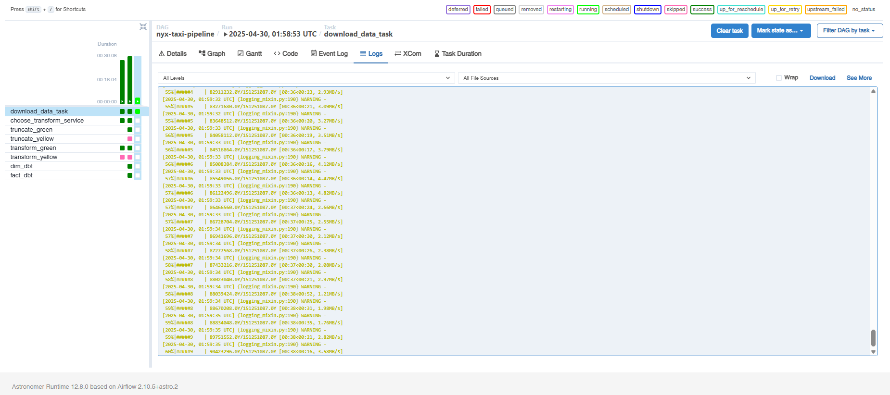

# NYC TAXI PIPELINE USING SPARK AND ASTRO CLI


This project was designed using Astro CLI, a framework based on Apache Airflow, integrated with DBT and Apache Spark to efficiently handle large-scale data extraction and transformation processes. The main dataset used in this project is the NYC public dataset, which is automatically downloaded from the web on a scheduled basis.

The entire pipeline is containerized using Docker, ensuring consistency and portability across development and production environments. For cloud infrastructure, the project leverages Google Cloud Platform (GCP) — specifically Google Cloud Storage for data lake storage and BigQuery for data querying and analysis.

Infrastructure provisioning and resource management are automated using Terraform, an Infrastructure-as-Code (IaC) tool, enabling reproducible and scalable deployment of cloud resources.

The final output of this project is tailored for business users or stakeholders who require a summarized report of company performance. These insights are delivered through Google Looker Studio, providing interactive and visually intuitive dashboards.

## Project Goal

1. **Automate Data Extraction and Transformation**: Build a fully automated pipeline to extract public datasets (NYC Open Data) from the web, transform them using scalable technologies (Spark, DBT), and load them into a cloud-based data warehouse.
2. **Enable Scalable Data Processing**: Handle large volumes of data efficiently using Apache Spark and modular transformation logic (DBT) for cleaner, reusable analytics workflows.
3. **Provide a Reproducible Infrastructure Setup**: Use Terraform to define infrastructure as code (IaC), allowing the pipeline to be deployed reliably across different environments (dev, staging, prod) with minimal manual setup.
4. **Leverage Cloud-native Technologies**: Utilize Google Cloud Platform (GCP) for storage, processing, and querying to ensure the system is scalable, secure, and cost-efficient.

- **Deliver Business Insights Through Visualization**: Empower decision-makers by presenting actionable insights via Google Looker Studio dashboards — focusing on key performance metrics derived from the data.

## Tech Stack

- Python
- Apache Spark
- DBT
- Airflow
- GCP Storage
- GCP BigQuery
- GCP Looker
- Terraform
- Docker

## Pipeline Process

`Install Astro CLI and create a new project`

```Shell
git clone winget install -e --id Astronomer.Astro

astro dev init
```

`Install Terraform`

```Bash
choco install terraform
```

`Clone project`

```Shell
git clone https://github.com/neinAlkem/nyc-taxi-etl.git
```

`Create GCP services account, make it admin for BigQuery and Storage`

`After that, copy and place it under cred_file.json (create it first)`

```Bash
mkdir include/credentials
mv cred_file.json include/credentials
```

`Setup Insfrastructure`

```Bash
terraform init
terraform plan
terraform apply
```

`Run astro`

```bash
astro dev start
```

`Configuration`

```text
In airflow UI, open Admin panel first and set variable year and services, also if considering using cluster, create new Connections named spark_default
```

## Project Documentation

`Extract / downloading data`



`Transforming and loading data`


`Merge data`


`Looker visualization`


